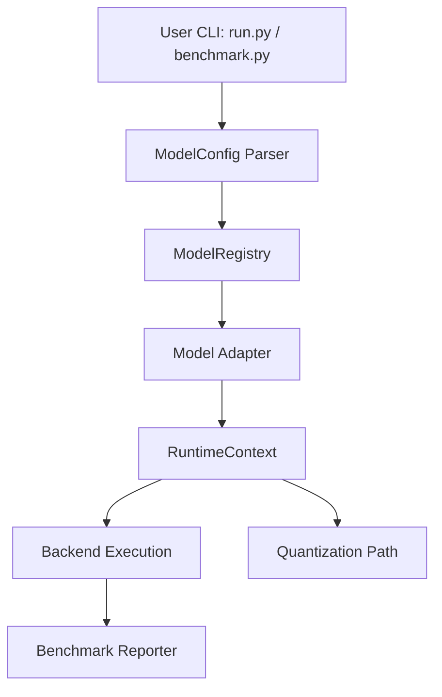

# llm-lite

[](https://github.com/hwkim-dev/llm-lite/actions)

> **llm-lite is a low-spec LLM systems lab for studying quantization, CPU/Vulkan/iGPU bottlenecks, BitNet ternary weights, and small-model inference across Gemma, Llama, Qwen, and DeepSeek-Distill.**

*Not a llama.cpp replacement. Not a vLLM engine.*

**Note:** This repo currently provides a runnable research scaffold; full inference support is experimental.

---

## Quick Start

You can verify that the platform scaffolding works by running a dry-run smoke test using our tiny stub model.

```bash
# Test Adapter Resolution
python run.py --model examples/tiny_model_stub --backend cpu --precision fp16 --dry-run

# Test Benchmark JSON/HTML generation
python benchmark.py --model examples/tiny_model_stub --backends cpu,vulkan --precisions fp16,int4 --dry-run

# Generate MD summary
python scripts/generate_report.py
```
*(Note: Dry-run is not a real performance measurement and loads no real weights. It verifies platform health.)*

---

## Why this exists
Running small LLMs on low-spec hardware remains difficult. Through this project, we are actively exploring:
- CPU memory bandwidth limitations
- iGPU offload overhead vs speedup
- INT4 vs FP16 quantization trade-offs
- KV-cache and decode bottlenecks
- BitNet ternary weight optimizations

## What makes this different
- **llama.cpp:** Broad production inference
- **bitnet.cpp:** Official 1-bit inference
- **vLLM:** High-throughput serving
- **MLC LLM:** Universal deployment
- **llm-lite:** Low-spec bottleneck research lab

---

## Architecture Design



## Supported Models

| Model Family | Example Model | Config Parsing | CPU Reference | Quantization | Vulkan | Status |
|---|---|---|---|---|---|---|
| Gemma3N | gemma-3n-e4b | Yes | Yes (Legacy) | fp16/int8/int4 | Yes | Legacy working path |
| Llama | llama-3.2-1b | Yes | Skeleton | fp16/int8/int4 | Skeleton | Runnable dry-run adapter |
| Qwen | qwen2.5-1.5b | Yes | Skeleton | fp16/int8/int4 | Skeleton | Runnable dry-run adapter |
| DeepSeek | deepseek-r1-distill-qwen-1.5b| Yes | Skeleton | fp16/int8/int4 | Skeleton | Runnable dry-run adapter |
| BitNet | bitnet-b1.58-2b | Yes | Experimental | ternary | Planned | Experimental skeleton |

## Backends & Precision

| Backend | Target | Status | Notes |
|---|---|---|---|
| `cpu` | x86 / ARM CPU | Runnable | Reference CPU Implementation |
| `vulkan` | iGPU / dGPU via Vulkan | Skeleton | Targeted for offloading |
| `npu_uca` | FPGA-style NPU | Experimental | Bare-metal research path |

| Precision | Target Models | Status | Notes |
|---|---|---|---|
| `fp16` | llama, qwen, gemma3n, deepseek-distill | Skeleton | Standard 16-bit float |
| `int8` | llama, qwen, gemma3n, deepseek-distill | Skeleton | 8-bit integer |
| `int4` | llama, qwen, gemma3n, deepseek-distill | Skeleton | 4-bit integer |
| `ternary`| bitnet | Experimental | -1, 0, +1 quantization |

---

## Real Gemma3N Legacy Path

The original legacy working path for Gemma3N E4B inference on C++ and PyNQ is preserved under the `x64/gemma3N_E4B/` directory. That code contains real implementations for optimizations but is distinct from the new modular research engine (`engine/`).
